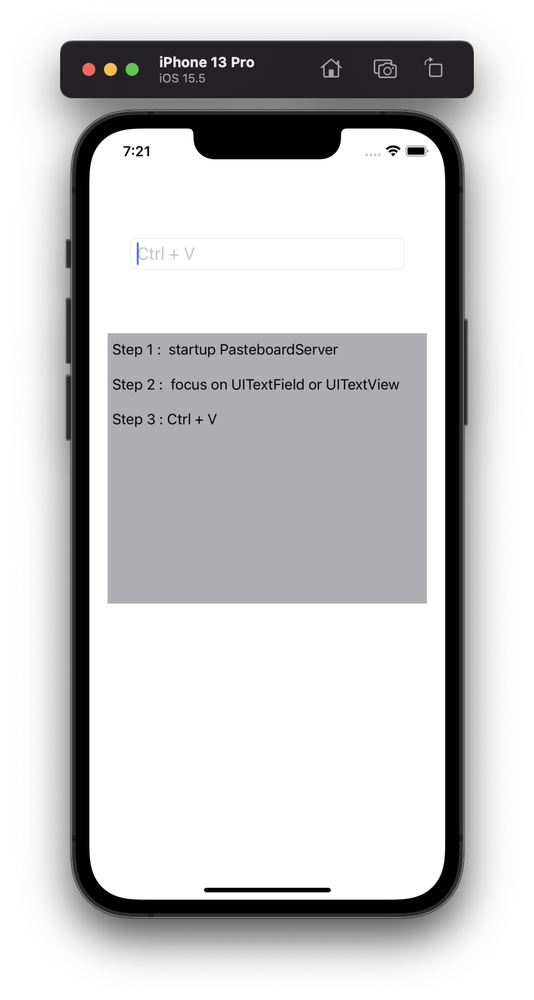

# M1Pasteboard

This is a simple solution to the clipping board problem of Apple silicon MAC IOS simulator.

## Working Principle
* Start an HTTP service locally. After receiving the request, the service will return the current clipboard content.
* Customize the shortcut key `Ctrl + V` on the app side. Put the input box(UITextField or UITextView) is in editing status, start this shortcut key, then send an HTTP request, and automatically fill the input box after getting the result. The code has been encapsulated and can be directly integrated.

## Introduction
* PasteboardServer is a mac app, it supports startup and custom HTTP ports

	 

## Inspire
[CocoaHTTPServer](https://github.com/robbiehanson/CocoaHTTPServer)
[findFirstResponder](https://stackoverflow.com/questions/1823317/get-the-current-first-responder-without-using-a-private-api)
